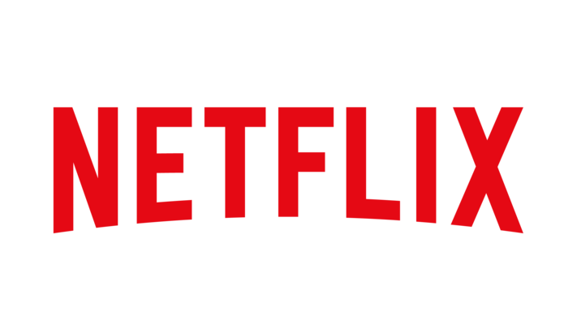
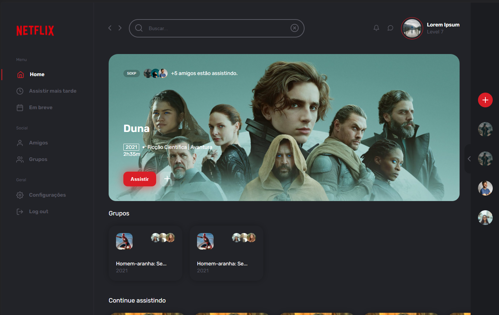

<h1 align="center">
 
  
 
 
</h1>

Netflix redesign: Este projeto foi um desafio proposto no Bootcamp Banco Inter Front-End da DIO. A proposta era o aluno com suas habilidades aprendidas no curso e com a ajuda do professor(se precisasse) desenvolver um clone da interface do Netflix, porém estavamos livres para adicionar novas funcionalidade, criar algo novo etc. Então eu decidi não por fazer um clone da interface e criar um redesign completo da página inicial do Netflix. A ideia principal foi de deixar o site gamificado, abaixo terá uma printscreen para demonstrar a página desenvolvida e logo após estará listada as tecnologias usadas.

[//]: # (Add your gifs/images here:)

  

## Tecnologias
[//]: # (Add the features of your project here:)

*Obs.: O requisito do projeto era usar as 3 tecnologias web html, css e javascript.*

- ✏️ **HTML**
- 🖌 **CSS**
- 📝 **Javascript**
- 🔴 **Gulp**
- ⚪ **Feather icons**
  
## Clonando

1. Clone este repositório usando `git clone git@github.com:Salv-Dev/netflix-redesign.git`
2. Vá para o diretório: `cd netflix-redesign` 

### Iniciando o projeto
1. Rode `npm i` para instalar as dependências.
2. Instale e depois rode o comando `gulp` para criar a pasta `/dist` com os arquivos css e js.
3. Depois abra o arquivo `index.html` em seu navegador.